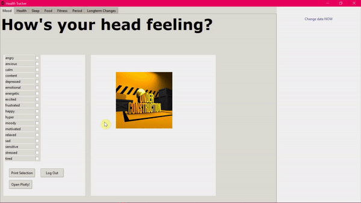
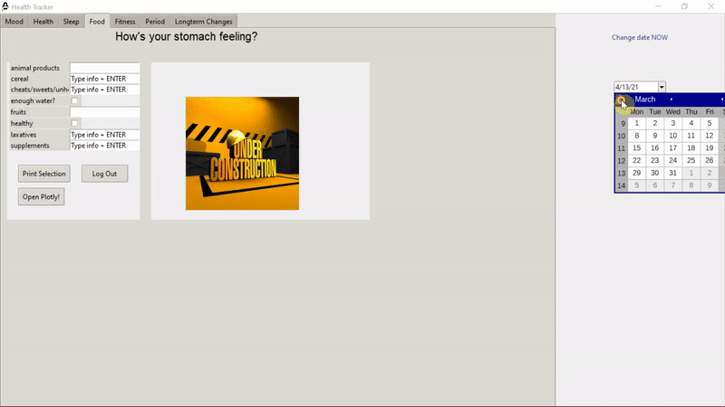
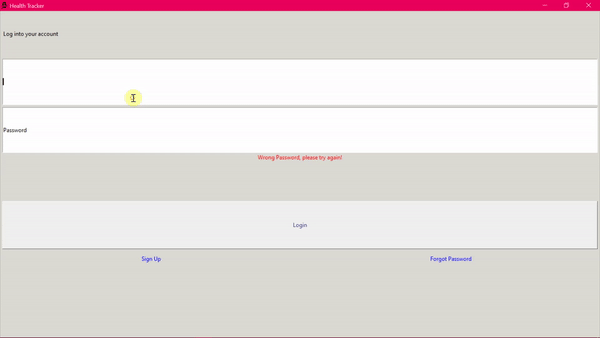

# Health-Tracker-App
Personalized Health Tracker GUI  

The health tracker was built using Tkinter and is running on a PostgreSQl database to store information inserted into GUI. 

Installation: 
- `git clone https://github.com/lasupernova/Health-Tracker-App.git`

Usage: 
`python tracker.py`

### Functionality  

#### Sign Up 
The signup page can be reached by activatign the signup button on the initial (login) page. User inout will be checked for validity, meaning that the username can not yet exist in the database and that the password needs to be > 6 letters long. Password requirements will change in the future and will require users to choose a safe password (which a 6-letter password - worse without requirements for alternative characters - is certainly not). 
After entering a valid username and password, the user will be led through some pages collecting user information, including the user's gender and DOB. 
Finally, the user will be transferred to the login page after successful sign up.
  

 

#### Login 
Th login page is the initial page that is opened once the program is opened. The program will check the entered credentials and will open the health tracker part of the GUI (carrying the users previously inserted data) upon successful login.
  

 

#### Tabs and Input 
Currently the default tabs and tab options are displayed. The user can change from one tab to another by clicking and can add information, whcih will be uploaded to the database upon switching tabs (for the current tab) or upon turning off the program (--> database upload upon logging out needs yet to be implemented).
  

 

#### Changing Dates 
The date can be changed using the toggable date picker widget. If entries already exist for the chosen date, the existing data is going to be requested from the database and filled into the GUI at the correct location. Once the data is inserted into the GUI, changes can be made. Any new changes will then be inserted and commited to the database.  

 

#### Logout and Switching Users 
The logout button can be used to log out the current user. Logging out will bring the user back to the login page, where a new user cna then log in.
  

 

#### Custom GUI Based On User Info 
The GUI will have different sections based on user information. Currently, the GUI automatically disables the 'period'-section once a user identifying as 'male' logs in.
However, this functionality will be enhanced in the future, in order to allow users to individually choose their desired sections and increase the potential for customization even further.
  

 
 
 

