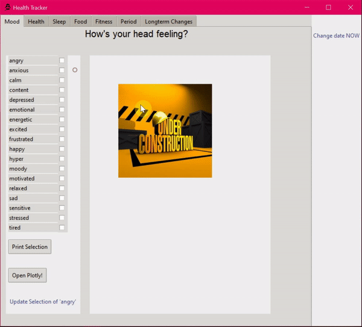

# Health-Tracker-App
Personalized Health Tracker GUI  

The health tracker was built using Tkinter and is running on a PostgreSQl database to store information inserted into GUI. 

Usage: 
`python tracker.py`

----- Under Construction -----  
Current Look: 
<!------>

 
 
 
2021-02-12
